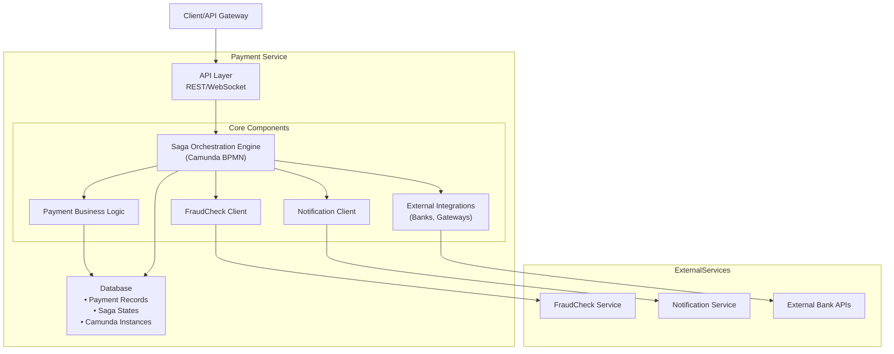
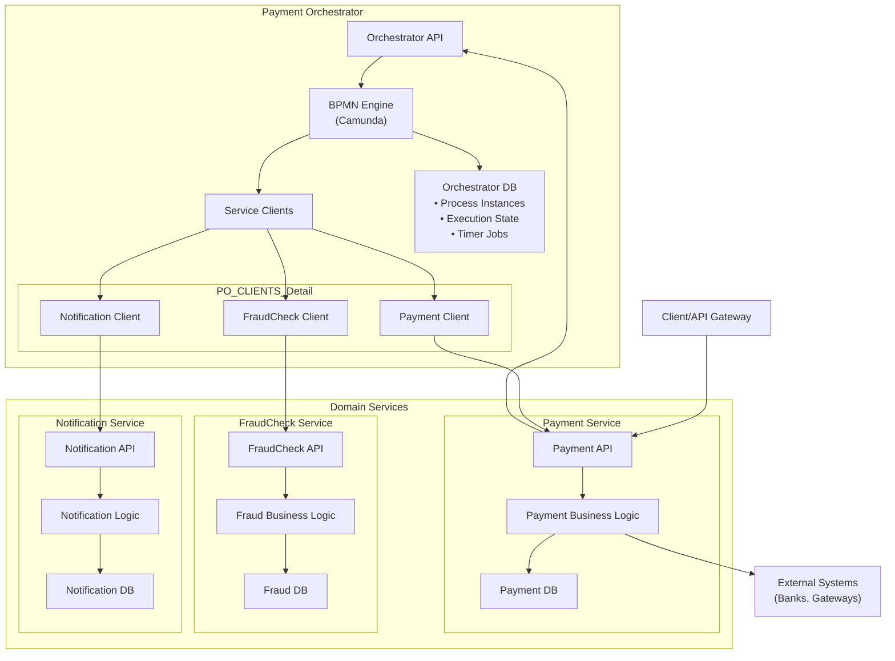
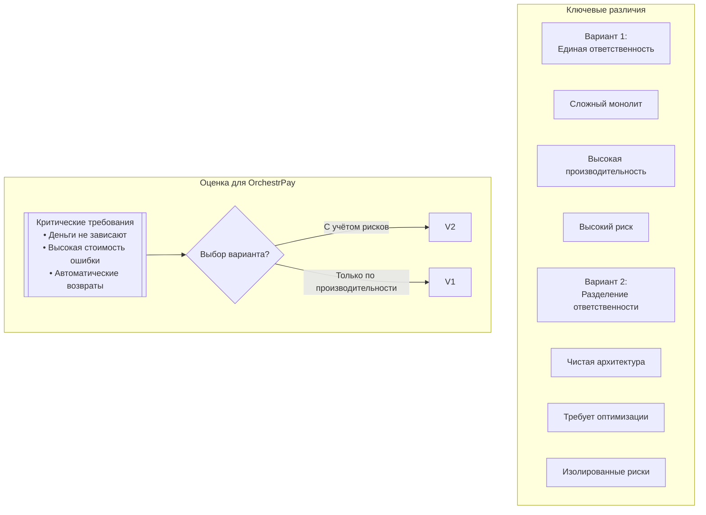
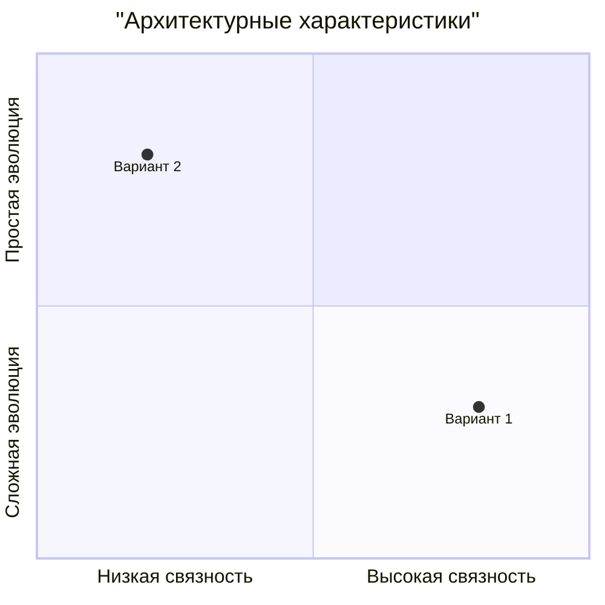

### <a name="_b7urdng99y53"></a>**Название задачи:** Размещение функции оркестрации платежного процесса
### <a name="_hjk0fkfyohdk"></a>**Автор:** Гуреев Евгений
### <a name="_uanumrh8zrui"></a>**Дата:** январь 2026


## Общая информация

1. [Родительский артефакт](../task1/README.md)
2. Автор ADR - Гуреев Евгений
3. Статус - Принят
4. Согласующие - Техлид, Архитектор, Аналитик, Руководитель проекта, Руководитель безопасности


## Контекст

Платёжный процесс OrchestrPay является сложным распределённым бизнес-процессом, требующим координации нескольких сервисов:
- `Payment Service`: списание средств, перевод контрагенту
- `FraudCheck Service`: антифрод-проверки (включая ручную проверку до 20 минут)
- `Notification Service`: уведомления клиента
- **Внешние системы**: банки, платёжные шлюзы, compliance-проверки

Ключевые характеристики процесса:
- Долгоживущие операции: ручная проверка до 20 минут + cut-off таймер
- Жёсткие требования к надёжности: "деньги не должны зависать"
- Строгое SLA: <5 секунд для 90% успешных транзакций
- Компенсационные транзакции: автоматические возвраты при отказах
- Наблюдаемость: полная трассировка для бизнеса и безопасности

Для управления процессом выбран паттерн Saga-оркестрации с использованием Camunda BPMN.

**Архитектурная дилемма**:  
Разместить логику оркестрации внутри доменного сервиса (Payment Service) или выделить в отдельный сервис-оркестратор.


## Рассмотренные варианты


### Вариант №1 Оркестрация внутри Payment Service

Payment Service становится ответственным и за доменную логику платежей, и за управление Saga-процессом. Camunda интегрируется непосредственно в сервис.

```
Клиент --> [Payment Service (доменная логика + Camunda)] --> FraudCheck/Notification/Внешние системы
```

Mermaid:



### Вариант №2 Выделенный сервис Payment Orchestrator

Создаётся отдельный микросервис Payment Orchestrator, который управляет процессом, координируя доменные сервисы через чёткие контракты.  
Доменные сервисы выполняют атомарные операции по командам оркестратора.

```
Клиент --> [Payment Orchestrator (Camunda BPMN)] --> [Payment Service] --> [FraudCheck Service] --> [Notification Service]
```

Mermaid:



## Сравнение альтернатив

| Критерий | Вариант №1 (в Payment Service) | Вариант №2 (отдельный Orchestrator) |
|----------|--------------------------------|-------------------------------------|
| Разделение ответственности | `[X]` Нарушение SRP, Payment Service становится "god-service" | `[V]` Чёткое разделение: доменные сервисы VS управление процессом |
| Производительность (SLA) | `[V]` Меньше сетевых вызовов, проще достичь <5с | `[—]` Дополнительные сетевые вызовы, требует оптимизации |
| Наблюдаемость процесса | `[—]` Состояние платежа и процесса смешаны | `[V]` Централизованное управление состоянием Saga, прозрачность |
| Масштабируемость | `[X]` Сложно масштабировать отдельно оркестрацию | `[V]` Независимое масштабирование оркестратора и доменных сервисов |
| Устойчивость к сбоям | `[—]` Сбой Camunda влияет на весь Payment Service | `[V]` Изоляция: падение оркестратора не блокирует доменные сервисы полностью |
| Эволюция бизнес-процесса | `[X]` Изменение BPMN требует релиза Payment Service | `[V]` Изменение процесса без модификации доменных сервисов |
| Сложность разработки | `[V]` Проще начать, один сервис | `[—]` Требует чётких контрактов и распределённой трассировки |
| Безопасность и аудит | `[—]` Смешаны доменная логика и процесс | `[V]` Единая точка аудита процесса для безопасности |
| Долгосрочная поддержка | `[X]` Риск превращения в монолит | `[V]` Архитектура готова к добавлению новых процессов |

### Ключевые различия вариантов:


### Квадрат сравнения:



## Принятое решение

Вариант №2: Выделенный сервис Payment Orchestrator

### Обоснование выбора

1. Надёжность важнее производительности
   - "Деньги не должны зависать"
   - Отдельный оркестратор обеспечивает лучшее управление компенсациями и восстановлением после сбоев
2. Сложность и "длительность" процесса
   - Ручная проверка (до 20 минут), cut-off таймеры, ожидание внешних ответов
   - Долгоживущие процессы лучше изолировать от критичного Payment API
3. Наблюдаемость для безопасности и бизнеса
   - Для безопасности нужен прозрачный обзор всего процесса
   - Отдельный оркестратор - это "единый источник истины" о состоянии Saga
4. Развитие архитектуры
   - Отдельный оркестратор позволяет независимо развивать:
     - Доменные сервисы (Payment, FraudCheck)
     - Бизнес-процессы (добавлять новые проверки, изменять потоки)
5. Масштабируемость и эксплуатация
   - Payment Service масштабируется под нагрузку API
   - Orchestrator масштабируется под нагрузку процессов и таймеров
   - Раздельные стратегии развёртывания и мониторинга

### Архитектурные последствия

1. Новый сервис: Payment-Orchestrator-Service (Camunda BPMN + собственная БД состояний)
2. Контракты взаимодействия:
   - Команды от Orchestrator к доменным сервисам (идемпотентные)
   - События от доменных сервисов к Orchestrator (через шину или webhook)
3. Распределённая трассировка: обязательное использование correlationId, paymentId, sagaId и т.д.
4. Мониторинг: отдельные дашборды для оркестратора (процессы) и доменных сервисов (бизнес-метрики)
