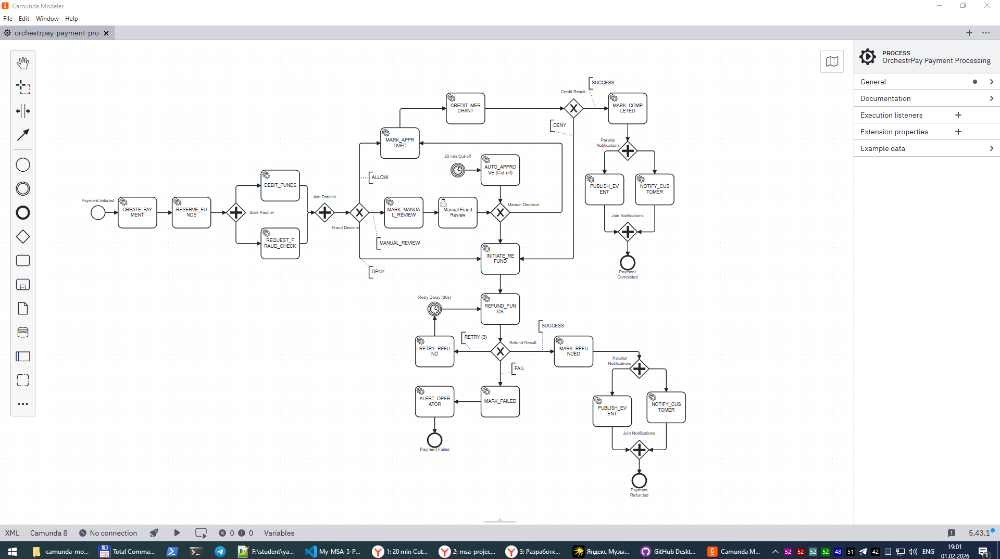
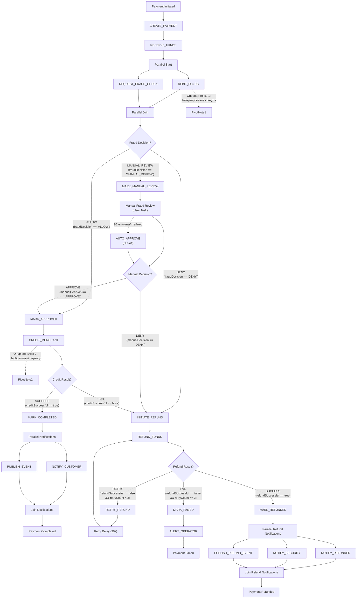

### **Название задачи:** Формирование BPM-процесса
### **Автор:** Гуреев Евгений
### **Дата:** январь 2026

На основании [шагов Saga](../task1/README.md), [Применения State Machine](../task2/README.md) и [выбора размещения функции оркестрации платежного процесса](../task3/README.md) сформирована следующая схема: [orchestrpay-payment-process.bpmn](./orchestrpay-payment-process.bpmn)

Представление в Mermaid:

